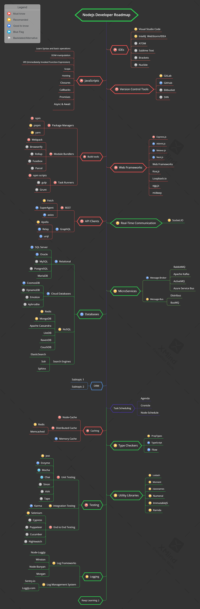

# NodeJS Developer Roadmap

> Roadmap to becoming a NodeJS developer in 2021:

Below you can find a chart demonstrating the paths that you can take and the libraries that you would want to learn to become a NodeJS developer. I made this chart as a tip for everyone who asks me, "What should I learn next as a NodeJS developer?"

## Disclaimer

> The purpose of this roadmap is to give you an idea about the landscape. The road map will guide you if you are confused about what to learn next, rather than encouraging you to pick what is hip and trendy. You should grow some understanding of why one tool would be better suited for some cases than the other and remember hip and trendy does not always mean best suited for the job

## Give a Star! :star:

If you like or are using this project to learn or start your solution, please give it a star. Thanks!

## Roadmap

## Resources

1. IDEs

   - [visualstudioCode](https://code.visualstudio.com/Download)

2. JavaScript

   _Basic_

   - [w3schools](https://www.w3schools.com/js/default.asp) JavaScript Tutorial
   - [developer.mozilla](https://developer.mozilla.org/en-US/docs/Web/JavaScript) JavaScript
   - [javascript.info](https://javascript.info/) The Modern JavaScript Tutorial
   - [htmlcheatsheet](https://htmlcheatsheet.com/js/) JS CheatSheet

   _es6_

   - [exploringjs](https://exploringjs.com/es6/index.html) Exploring ES6
   - [es6-features](http://es6-features.org/#Constants) ECMAScript 6 — New Features: Overview & Comparison
   - [jsfeatures](https://jsfeatures.in) jsfeatures
   - [babeljs](https://babeljs.io/docs/en/learn) Learn ES2015
   - [github](https://github.com/lukehoban/es6features) ECMAScript 6
   - [github](https://github.com/sudheerj/ECMAScript-features) ECMAScript 6

   _Style Guide_

   - [github](https://github.com/airbnb/javascript) Airbnb JavaScript Style Guide
   - [github](https://github.com/ryanmcdermott/clean-code-javascript) clean-code-javascript
   - [w3schools](https://www.w3schools.com/js/js_conventions.asp) js_conventions

   _playground_

   - [js-array-playground](https://js-array-playground.firebaseapp.com/) JavaScript Array Playground
   - [jsfiddle](https://jsfiddle.net/)
   - [plnkr](https://plnkr.co/)
   - [jsbin](https://jsbin.com/?html,output)
   - [codepen](https://codepen.io/pen/)
   - [stackblitz](https://stackblitz.com/)

3. Build Tools

   - Package Managers
     - [npm](https://www.npmjs.com/)
     - [yarn](https://yarnpkg.com/lang/en/)
     - [pnpm](https://pnpm.js.org/)
   - Task Runners

     - [nodemon](https://www.npmjs.com/package/nodemon)
     - [pm2](https://pm2.keymetrics.io/)
     - [gulp](https://gulpjs.com/)
     - [grunt](https://gruntjs.com/)
     - [LiveReload](https://gruntjs.com/)
     - [forever](https://gruntjs.com/)

   - Module Bundlers
     - [Webpack](https://webpack.js.org/)
     - [Bazel](https://bazel.build/)
     - [Rollup](https://rollupjs.org/guide/en)
     - [Browserify](http://browserify.org/)
     - [FuseBox](https://fuse-box.org/)

4. Web Frameworks

   - [Express.js](https://expressjs.com/)
   - [Adonis.js](https://adonisjs.com/)
   - [Meteor.js](https://www.meteor.com/)
   - [Nest.js](https://nestjs.com/)
   - [Sails.js](https://sailsjs.com/)
   - [Koa.js](https://koajs.com/)
   - [Loopback.io](https://loopback.io/)
   - [egg.js](https://eggjs.org/en/index.html)
   - [midway](https://midwayjs.org/midway/en/)

5. API Clients

   - REST
     - [Fetch](https://developer.mozilla.org/en-US/docs/Web/API/Fetch_API)
     - [SuperAgent](https://visionmedia.github.io/superagent/)
     - [axios](https://github.com/axios/axios)
   - GraphQL
     - [Apollo](https://www.apollographql.com/docs/react/)
     - [Relay](https://facebook.github.io/relay/)
     - [urql](https://github.com/FormidableLabs/urql)

6. Real-Time Communication

   - [Socket.IO](https://socket.io/)

7. MicroServices

   - Message-Broker
     - [RabbitMQ](https://www.rabbitmq.com/tutorials/tutorial-one-javascript.html)
     - [Apache Kafka](https://www.npmjs.com/package/kafka-node)
     - [ActiveMQ](https://github.com/apache/activemq)
     - [Azure Service Bus](https://docs.microsoft.com/en-us/azure/service-bus-messaging/service-bus-messaging-overview)
   - Message-Bus
     - [Distribus](https://distribus.com/)
     - [BusMQ](https://github.com/capriza/node-busmq)

8. Task Scheduling

   - [Agenda](https://github.com/agenda/agenda)
   - [Cronicle](https://github.com/jhuckaby/Cronicle)
   - [Node-Schedule](https://www.npmjs.com/package/node-schedule)

9. ORM

   - [sequelize](https://sequelize.org/) Sequelize is a promise-based Node-js ORM that is compatible with Maria DB, Postgress, MySQL, SQLite, and Microsoft SQL
   - [Mongoose](https://mongoosejs.com/) mongodb object modeling for node.js
   - [knex](https://www.npmjs.com/package/knex) A query builder for PostgreSQL, MySQL, SQL Server, SQLite3 and Oracle, designed to be flexible, portable, and fun to use.
   - [typeorm](https://www.npmjs.com/package/typeorm) ORM for TypeScript and JavaScript (ES7, ES6, ES5). Supports MySQL, PostgreSQL, MariaDB, SQLite, MS SQL Server, Oracle, SAP Hana, WebSQL databases. Works in NodeJS, Browser, Ionic, Cordova and Electron platforms.

10. Databases

    1. Relational
       - [PostgreSQL](https://www.postgresql.org)
       - [MySQL](https://www.mysql.com)
       - [MariaDB](https://mariadb.org)
       - [SQL Server](https://www.microsoft.com/sql-server/sql-server-2019)
       - [Oracle](https://www.oracle.com/database/technologies/oracle-database-software-downloads.html)
    2. Cloud Databases
       - [CosmosDB](https://docs.microsoft.com/azure/cosmos-db)
       - [DynamoDB](https://aws.amazon.com/dynamodb)
    3. NoSQL
       - [Redis](https://redis.io)
       - [MongoDB](https://docs.microsoft.com/aspnet/core/tutorials/first-mongo-app)
       - [Apache Cassandra](http://cassandra.apache.org)
       - [LiteDB](https://github.com/mbdavid/LiteDB)
       - [RavenDB](https://github.com/ravendb/ravendb)
       - [CouchDB](http://couchdb.apache.org)

11. Security Libraries

    - [bcryptjs](https://auth0.com/blog/complete-guide-to-nodejs-express-user-authentication/)
    - [cors](https://auth0.com/blog/complete-guide-to-nodejs-express-user-authentication/)
    - [jsonwebtoken](https://auth0.com/blog/complete-guide-to-nodejs-express-user-authentication/)
    - [express-jwt](https://auth0.com/blog/complete-guide-to-nodejs-express-user-authentication/)
    - [joi](https://auth0.com/blog/complete-guide-to-nodejs-express-user-authentication/)
    - [Passport JS](http://www.passportjs.org/)
    - [Auth0](https://auth0.com/blog/complete-guide-to-nodejs-express-user-authentication/)
    - [nodemailer](http://www.passportjs.org/)

12. Utility Libraries

    - [JSHint](https://github.com/jshint/jshint)
    - [commander](https://github.com/tj/commander.js/)
    - [Async.js](https://caolan.github.io/async/)
    - [Lodash](https://lodash.com/)
    - [Moment](https://momentjs.com/)
    - [classnames](https://github.com/JedWatson/classnames)
    - [Numeral](http://numeraljs.com/)
    - [ImmutableJS](https://facebook.github.io/immutable-js/)
    - [Ramda](https://ramdajs.com/)

13. Type Checkers

- [PropTypes](https://reactjs.org/docs/typechecking-with-proptypes.html)
- [TypeScript](https://www.typescriptlang.org/)
- [Flow](https://flow.org/en/)

14. Logging

    - Log Frameworks
      - [Node-Loggly](https://www.loggly.com/docs/node-js-logs-2/)
      - [Winston](https://github.com/winstonjs/winston)
      - [Node-Bunyan](https://github.com/trentm/node-bunyan)
      - [Morgan](https://github.com/expressjs/morgan)
    - Log Management System
      - [Sentry.io](http://sentry.io/),
      - [Loggly.com](https://loggly.com/)

15. Testing

    - Unit Testing
      - [Jest](https://facebook.github.io/jest/)
      - [Enzyme](http://airbnb.io/enzyme/)
      - [Sinon](http://sinonjs.org/)
      - [Mocha](https://mochajs.org/)
      - [Chai](http://www.chaijs.com/)
      - [AVA](https://github.com/avajs/ava)
      - [Tape](https://github.com/substack/tape)
    - End to End Testing
      - [Selenium](https://www.seleniumhq.org/),
      - [Webdriver](http://webdriver.io/)
      - [Cypress](https://cypress.io/)
      - [Puppeteer](https://pptr.dev/)
      - [Cucumber.js](https://github.com/cucumber/cucumber-js)
      - [Nightwatch.js](http://nightwatchjs.org/)
    - Integration Testing
      - [Karma](https://karma-runner.github.io/)

## Contribution

If you want to contribute to this project to make it more helpful for other React developers, your help is very welcome!

Just file an issue, better yet: submit a PR! 🙂

## License

